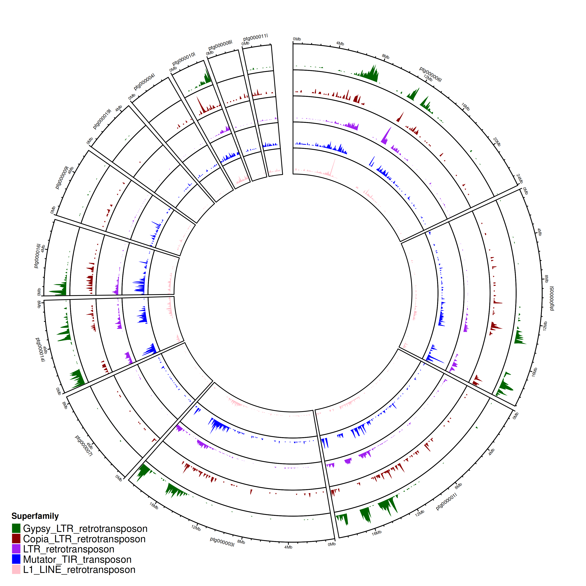
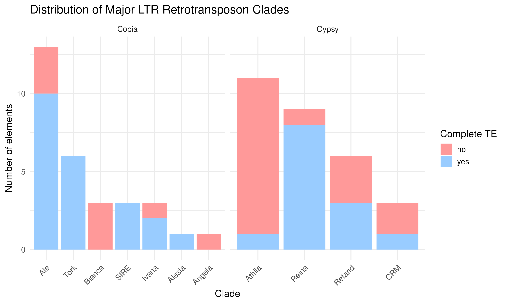
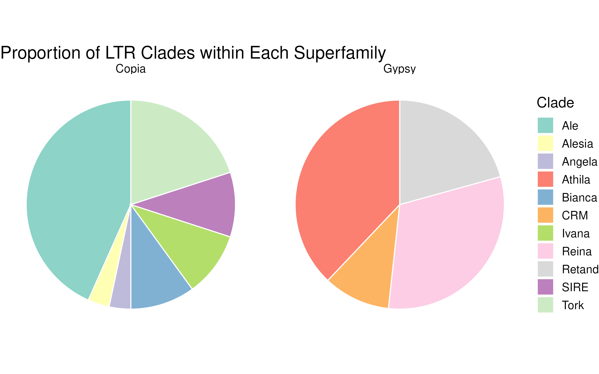
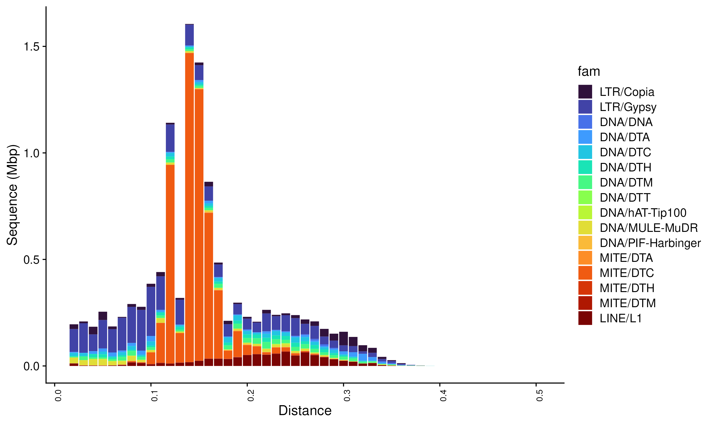
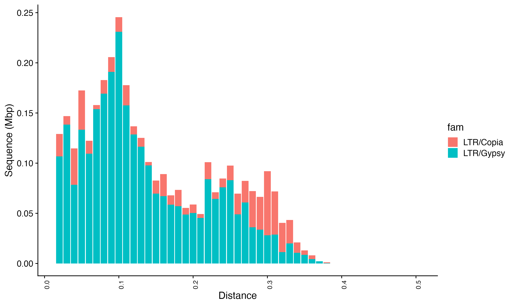

# UE-SBL.30004 Organisation and Annotation of Eukaryote Genomes

## Transposable Element Annotation and Classification  

### 1. TE Annotation using EDTA

#### LTR-RTs
Counts per clade
| Clade    | Counts |
| -------- | ------- |
| Ale  | 28    |
| Alesia | 1     |
| Angela    | 2    |
| Athila | 43 |
| Bianca | 12 |
| CRM | 8 |
| Ikeros | 1 |
| Ivana | 11 |
| Reina | 20 |
| Retand | 17 |
| SIRE | 5 |
| TAR | 1 |
| Teaky | 4 |
| Trok | 15 |
| unknown | 1 |
| < NA > | 431 |

The results show that there are differences in the number of full length LTR-RTs between the clades with Athila having the most counts followed by Ale and Reina.

#### Percent Identiy of Clades


- High percent identity: Ale, Angela, Tekay, Reina → recent insertions
- Low percent identity: Bianca, Tork, CRM

### 2. Visualizing and comparing TE annotations from EDTA

#### EDTA TE summary
```r
Repeat Classes
==============
Total Sequences: 520
Total Length: 149560242 bp
Class                  Count        bpMasked    %masked
=====                  =====        ========     =======
DNA_transposon         78           55823        0.04% 
LINE                   --           --           --   
    L1                 1347         834634       0.56% 
LTR                    --           --           --   
    Copia              796          1052818      0.70% 
    Gypsy              3066         3586218      2.40% 
    unknown            5721         7886168      5.27% 
TIR                    --           --           --   
    CACTA              2863         755234       0.50% 
    Mutator            1873         1100634      0.74% 
    PIF_Harbinger      1188         486219       0.33% 
    Tc1_Mariner        25           35538        0.02% 
    hAT                882          411110       0.27% 
nonTIR                 --           --           --   
    helitron           8232         4483177      3.00% 
rDNA                   --           --           --   
    45S                4358         2144197      1.43% 
repeat_fragment        1717         534383       0.36% 
                      ---------------------------------
    total interspersed 32146        23366153     15.62%

---------------------------------------------------------
Total                  32146        23366153     15.62%
```
→ 15.62% of genome is repetitive or transposable element (TE)-derived
- LTR retrotransposons (8.4%)
- DNA transposons (5%)
- rDNA (1.4%)
- LTR most abundant class in the genome
    - Gypsy most abundant identified superfamily


### Distribution of TEs across the genome 


- used 13 longest scaffolds -> coverage ~85.7%  

The plot shows region with high TE density across superfamilies and scaffolds. The distribution of the different clades overlap. Gypsy has the broadest, highest peaks while Copia is more puncuated and dispersed along scaffold arms. Peaks highlight centromeric regions.

### 3. Refining TE Classification with TEsorter
#### Counts per clade complete vs incomplete



#### Pie chart showing proportion of each clade in both superfamilies


#### Estimate of number of Copia and Gypsy elements in each clade
| Superfamily |	Clade |	count |	% |
| -------- | ------- |-------- | ------- |
| Copia |	Ale |	13 |	43.3 |
| Copia |	Tork |	6 |	20 |
| Copia |	Bianca |	3 |	10 |
| Copia |	Ivana |	3 |	10 |
| Copia |	SIRE |	3 |	10 |
| Copia |	Alesia |    1 |	3.3 |
| Copia |	Angela |	1 |	3.3 |
| Gypsy |	Athila |	11 |	37.9 |
| Gypsy |	Reina |	9 |	31.0 |
| Gypsy |	Retand |	6 |	20.7 |
| Gypsy |	CRM |	3 |	10.3 |

→ most abundant clade in Copia: Ale (43.3%)  
→ most abundant clade in Gypsy: Athila (37.9%)  

### 4. Dynamics of Transposable Elements (TEs)
#### Number of elements in each superfamily
| Class/Subclass |	Count |
| -------- | ------- |
| DNA/Helitron |	163 |
| DNA/DTM |	47 |
| DNA/DTC |	26 |
| DNA/DTH |	22 |
| DNA/DTA |	13 |
| DNA/MULE-MuDR |	7 |
| DNA/DTT |	3 |
| DNA/hAT-Tip100 |	2 |
| DNA/PIF-Harbinger |	2 |
| DNA/DNA |	1 |
| LINE/L1 |	13 |
| LTR/Copia |	61 |
| LTR/Gypsy |	53 |
| MITE/DTA |	12 |
| MITE/DTH |	12 |
| MITE/DTM |	12 |
| MITE/DTC |	2 |
| RC/Helitron |	5 |

#### Landscape Plot

- LINE/L1: from 0.1 to 0.35 with peak between 0.2 and 0.3 (curve)
    - high divergence
    - acient activity
- LTR/Gypsy: peak from 0 - 0.15 and then decreasing
    - recent expansions
- LTR/Copia: some peak between 0 and 0.1 and later at around 0.28 - 0.32
    - some recent expansions but also acient activity
    - low and high divergence
- MITE/DTC: high peaks between 0.1 and 0.2
    - major burst of MITE/DTC activity roughly 6-12 million years ago

#### TE dynamics between Copia and Gypsy


- Gypsy more active recently
- Copia expansion mostly ancient
- Gypsy contributes more to current genome size
- different peaks suggest different waves of expansion