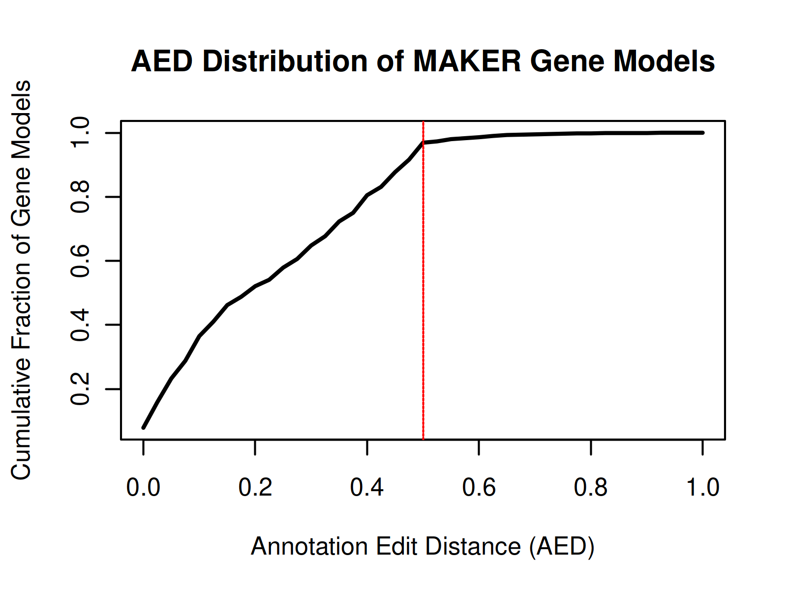

# UE-SBL.30004 Organisation and Annotation of Eukaryote Genomes

## Annotation of genes with the MAKER Pipeline 

### 5. Run Maker

#### Predicted Gene Models
```bash
$ grep -c -w "gene" hifiasm_Edi-0.all.maker.gff
```
MAKER predicted 601'709 gene models in the genome of Edi-0.

#### Comparison to reference *A. Thaliana* genome
- arabidopsis thaliana: 27’448 gene count (https://www.uniprot.org/proteomes/UP000006548 (17.11.2025))
- MAKER predicted 601'709 preliminary gene models in the *Edi-0* assembly. This number is considerably higher than the genes annotated in the *Arabidopsis thaliana* reference genome, indicating that the current dataset likely includes redundant or fragmented predictions. Subsequent filtering can help refine this set to high-confidence gene models.

### 6. Filtering and Refining Gene Annotations

#### AED Values


The annotation edit distance (AED) quantifies how well each gene is supported by RNA-seq and protein evidence
| AED Value | Cumulative Fraction |
| --------- | ----------------- |
| 0.000 | 0.07 |
| 0.025 | 0.15 |
| 0.050 | 0.23 |
| 0.075 | 0.28 |
| 0.100 | 0.36 |
| 0.125 | 0.41 |
| 0.150 | 0.46 |
| 0.175 | 0.48 |
| 0.200 | 0.521 |
| 0.225 | 0.541 |
| 0.250 | 0.579 |
| 0.275 | 0.606 |
| 0.300 | 0.648 |
| 0.325 | 0.677 |
| 0.350 | 0.723 |
| 0.375 | 0.750 |
| 0.400 | 0.805 |
| 0.425 | 0.831 |
| 0.450 | 0.877 |
| 0.475 | 0.916 |
| 0.500 | 0.969 |

- about 96.9% of the genes of *Edi-0* fall within the AED range of 0.0-0.5 which indicates high confidence in the gene models. The annotation is well supported by the evidence.

#### Support gene predictions with functional annotations
Tools like InterProScan help in supporting the gene prediction as it removes redundant or poorly supported predictions and yields a biologically validated gene set for downstream analyses. 

#### Predicted gene models after filtering
```bash
$ grep -c -w "gene" output/07_Final/UpdateFilter/Edi-0.filtered.genes.renamed.gff3
```
After filtering 69'609 genes remained from MAKER prediction.
