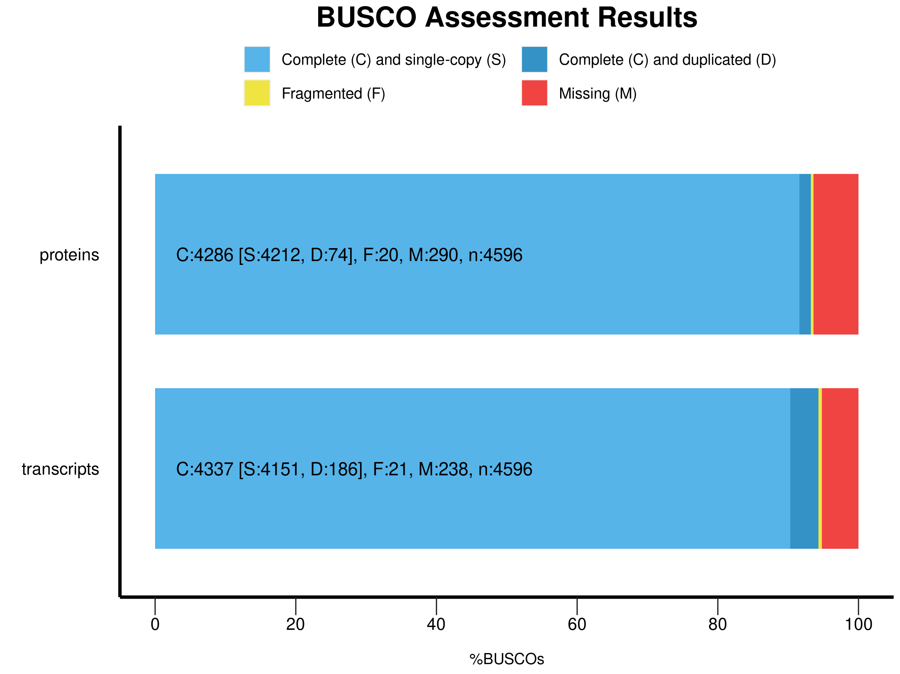

# UE-SBL.30004 Organisation and Annotation of Eukaryote Genomes

## Annotation of genes with the MAKER Pipeline 

### 5. Run Maker

#### Predicted Gene Models
```bash
$ awk '$3 == "gene" {count++} END {print count}' output/06_MAKER/PrepOutput/hifiasm_Edi-0.all.maker.gff
```
MAKER predicted 33'054 gene models in the genome of Edi-0.

#### Comparison to reference *A. Thaliana* genome
- arabidopsis thaliana: 27’448 gene count (https://www.uniprot.org/proteomes/UP000006548 (17.11.2025))
- MAKER predicted 33'054  preliminary gene models in the *Edi-0* assembly. This number is a bit higher than the genes annotated in the *Arabidopsis thaliana* reference genome, indicating that the current dataset likely includes redundant or fragmented predictions. Subsequent filtering can help refine this set to high-confidence gene models.

### 6. Filtering and Refining Gene Annotations

#### AED Values


The annotation edit distance (AED) quantifies how well each gene is supported by RNA-seq and protein evidence
| AED Value | Cumulative Fraction |
| --------- | ----------------- |
| 0.000 | 0.07 |
| 0.025 | 0.15 |
| 0.050 | 0.23 |
| 0.075 | 0.28 |
| 0.100 | 0.36 |
| 0.125 | 0.41 |
| 0.150 | 0.46 |
| 0.175 | 0.48 |
| 0.200 | 0.521 |
| 0.225 | 0.541 |
| 0.250 | 0.579 |
| 0.275 | 0.606 |
| 0.300 | 0.648 |
| 0.325 | 0.677 |
| 0.350 | 0.723 |
| 0.375 | 0.750 |
| 0.400 | 0.805 |
| 0.425 | 0.831 |
| 0.450 | 0.877 |
| 0.475 | 0.916 |
| 0.500 | 0.969 |

- about 96.9% of the genes of *Edi-0* fall within the AED range of 0.0-0.5 which indicates high confidence in the gene models. The annotation is well supported by the evidence.

#### Support gene predictions with functional annotations
Tools like InterProScan help in supporting the gene prediction as it removes redundant or poorly supported predictions and yields a biologically validated gene set for downstream analyses. 

#### Predicted gene models after filtering
```bash
$ awk '$3 == "gene" {count++} END {print count}' output/07_Final/UpdateFilter/Edi-0.filtered.genes.renamed.gff3 
```
After filtering 33'054 genes remained from MAKER prediction.

### 7. Quality Assessment of Gene Annotations
#### BUSCO Results
	

	***** Protein Results: *****

	C:93.2%[S:91.6%,D:1.6%],F:0.4%,M:6.4%,n:4596	   
	4286	Complete BUSCOs (C)			   
	4212	Complete and single-copy BUSCOs (S)	   
	74	Complete and duplicated BUSCOs (D)	   
	20	Fragmented BUSCOs (F)			   
	290	Missing BUSCOs (M)			   
	4596	Total BUSCO groups searched	

	***** Transcripts Results: *****

	C:94.3%[S:90.3%,D:4.0%],F:0.5%,M:5.2%,n:4596	   
	4337	Complete BUSCOs (C)			   
	4151	Complete and single-copy BUSCOs (S)	   
	186	Complete and duplicated BUSCOs (D)	   
	21	Fragmented BUSCOs (F)			   
	238	Missing BUSCOs (M)			   
	4596	Total BUSCO groups searched	

- Complete C: % of BUSCOs fully found
- single-copy S: % of BUSCOS found once
- duplicated D: % of BUSCOs found more than once
- fragmented F: % of BUSCOs partially recovered
- missing M: % of BUSCOs not found
- n: number of BUSCO orthologs in reference dataset
- Protein: high completeness, very low fragmentation, low duplication
    - C: 93.2%
    - S: 91.6%
    - D: 1.6%
    - F: 0.4%
    - M: 6.4%
    - n: 4596
- Transcripts: slightly higher completeness, more duplicates
    - C: 94.3%
    - S: 90.3%
    - D: 4.0%
    - F: 0.5%
    - M: 5.2%
    - n: 4596


#### Gene density vs TE density


- gene density higher where TE density is lower
- generally gene density is higher than TE density
- Large scaffolds appear to have long stretches of high gene density and almost no TE signal
- local TE bursts

#### AGAT results
| Metric | Value | Comment |
| ------ | ------ | ------- |
| Number of genes | 33054 | within expected range of A. thaliana accessions (27-36k) |
| Number of mRNAs | 36517 | slightly higher than genes -> genes with multiple isoforms |
| Number of mRNAs collapsed isoforms | 33054 | 
| Median gene length (bp) | 1527 |
| Max gene length (bp) | 27206 | 
| Min gene length (bp) | 15 |
| Median mRNA length (bp) | 1581 |
| Max mRNA length (bp) | 27206 | 
| Min mRNA length (bp) | 9 |
| Median exon length (bp) | 151 |
| Max exon length (bp) | 7761 | 
| Min exon length (bp) | 1 |
| Median intron length (bp) | 100 |
| Max intron length (bp) | 9595 | 
| Min intron length (bp) | 20 |
| Number of monoexonic genes | 10925 |
| Median number of exons per mRNA | 4.8 | matches known A. thaliana average (4-6 exons) | 
| genome coverage by genes | ~20% | good, expect 20-25% |