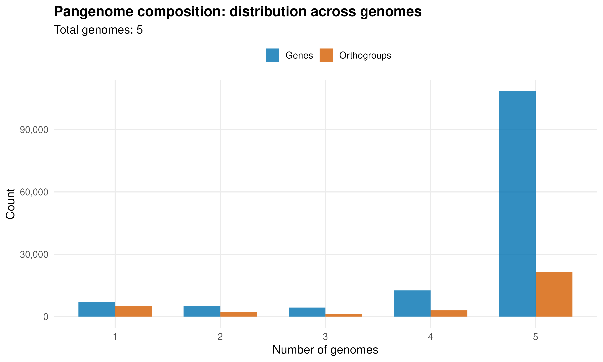

# UE-SBL.30004 Organisation and Annotation of Eukaryote Genomes

## Orthology based gene functional annotation and genome comparisons 

### 8. Sequence homology to functionally validated proteins (UniProt database and TAIR10)

#### Homology to known proteins
```bash
$ cut -f1 output/10_BLAST/blastp_output.besthits | sort -u | wc -l
26147
$ grep -c ">" output/08_1_BUSCO/prep/Edi-0.proteins.longest.fasta
33054
```
26'147 of the annotated proteins of the Edi-0 accession have homology to reviewd UniProt proteins. 
About 79% of the annotated proteins have a UniPort hit which indicate that the majority of the predicted proteins are biologically realistic and that the gene models are complete. The remaining proteins without hits are mostly short or lineage-specific sequences, which is expected in plant genomes.
This quality check demonstrates that the annotation is of good quality and suitable for downstream analysis.

#### Hit with well-annotated proteins vs. uncharacterised proteins
| Metric | Number | Percentage|
| --- | --- | --- |
| Total_queries_with_hits | 26147 | 100% |
| Uncharacterized_hits | 1684 | 6.4% |
| Well_annotated_hits | 24463 | 93.6% |

#### Length or completeness bias in proteins without UniProt hits

| Proteins with UniProt hits |  |
| --- | --- |
| Count | 26147 |
| Mean length (aa) | 402.91 |
| Median length (aa) | 344 |

| Proteins without UniProt hits |  |
| --- | --- |
| Count | 6907 |
| Mean length (aa) | 263.79 |
| Median length (aa) | 178 |

Yes, there is a length bias in proteins without UniProt hits. On average the proteins without UniProt homology are much shorter (178 aa vs. 344 aa) which indicates that they are either short fragments or incomplete gene models.

#### FLC gene (AT5G10140)
```bash
$ grep -i "AT5G10140" output/10_BLAST/blastp_output_TAIR10.besthits 
Edi-00017007-RA AT5G10140.1     49.438  89      37      2       67      147     57      145     1.62e-16        75.1
$ grep -A5 -B2 "Edi-00017007-RA" output/10_BLAST/filtered.maker.gff3.Uniprot.gff3
ptg000007l      maker   CDS     5959643 5959831 .       +       0       ID=Edi-00017006-RA:cds;Parent=Edi-00017006-RA;
ptg000007l      maker   gene    5961767 5963263 .       +       .       ID=Edi-00017007;Name=Edi-00017007;Alias=augustus_masked-ptg000007l-processed-gene-59.90;Note=Similar to AGL27: Agamous-like MADS-box protein AGL27 (Arabidopsis thaliana);
ptg000007l      maker   mRNA    5961767 5963263 .       +       .       ID=Edi-00017007-RA;Parent=Edi-00017007;Name=Edi-00017007-RA;Alias=augustus_masked-ptg000007l-processed-gene-59.90-mRNA-1;_AED=0.67;_QI=0|0|0|0.75|1|1|8|0|243;_eAED=0.67;_merge_warning=1;Note=Similar to AGL27: Agamous-like MADS-box protein AGL27 (Arabidopsis thaliana);
ptg000007l      maker   exon    5961767 5961823 .       +       .       ID=Edi-00017007-RA:1;Parent=Edi-00017007-RA;
ptg000007l      maker   exon    5961939 5962034 .       +       .       ID=Edi-00017007-RA:2;Parent=Edi-00017007-RA;
ptg000007l      maker   exon    5962215 5962310 .       +       .       ID=Edi-00017007-RA:3;Parent=Edi-00017007-RA;
ptg000007l      maker   exon    5962380 5962441 .       +       .       ID=Edi-00017007-RA:4;Parent=Edi-00017007-RA;
ptg000007l      maker   exon    5962531 5962630 .       +       .       ID=Edi-00017007-RA:5;Parent=Edi-00017007-RA;
ptg000007l      maker   exon    5962758 5962887 .       +       .       ID=Edi-00017007-RA:6;Parent=Edi-00017007-RA;
ptg000007l      maker   exon    5962964 5963049 .       +       .       ID=Edi-00017007-RA:7;Parent=Edi-00017007-RA;
ptg000007l      maker   exon    5963159 5963263 .       +       .       ID=Edi-00017007-RA:8;Parent=Edi-00017007-RA;
ptg000007l      maker   CDS     5961767 5961823 .       +       0       ID=Edi-00017007-RA:cds;Parent=Edi-00017007-RA;
ptg000007l      maker   CDS     5961939 5962034 .       +       0       ID=Edi-00017007-RA:cds;Parent=Edi-00017007-RA;
ptg000007l      maker   CDS     5962215 5962310 .       +       0       ID=Edi-00017007-RA:cds;Parent=Edi-00017007-RA;
ptg000007l      maker   CDS     5962380 5962441 .       +       0       ID=Edi-00017007-RA:cds;Parent=Edi-00017007-RA;
ptg000007l      maker   CDS     5962531 5962630 .       +       1       ID=Edi-00017007-RA:cds;Parent=Edi-00017007-RA;
ptg000007l      maker   CDS     5962758 5962887 .       +       0       ID=Edi-00017007-RA:cds;Parent=Edi-00017007-RA;
ptg000007l      maker   CDS     5962964 5963049 .       +       2       ID=Edi-00017007-RA:cds;Parent=Edi-00017007-RA;
ptg000007l      maker   CDS     5963159 5963263 .       +       0       ID=Edi-00017007-RA:cds;Parent=Edi-00017007-RA;
ptg000007l      maker   gene    5964966 5969780 .       +       .       ID=Edi-00017008;Name=Edi-00017008;Alias=maker-ptg000007l-augustus-gene-59.62;Dbxref=InterPro:IPR002100,InterPro:IPR002487,Pfam:PF00319,Pfam:PF01486;Ontology_term=GO:0003677,GO:0003700,GO:0005634,GO:0006355,GO:0046983;Note=Similar to MAF5: Protein MADS AFFECTING FLOWERING 5 (Arabidopsis thaliana);
ptg000007l      maker   mRNA    5964966 5969780 .       +       .       ID=Edi-00017008-RA;Parent=Edi-00017008;Name=Edi-00017008-RA;Alias=maker-ptg000007l-augustus-gene-59.62-mRNA-1;_AED=0.45;_QI=19|0.37|0.55|0.77|0.87|0.77|9|240|239;_eAED=0.45;Dbxref=InterPro:IPR002100,InterPro:IPR002487,Pfam:PF00319,Pfam:PF01486;Ontology_term=GO:0003677,GO:0003700,GO:0005634,GO:0006355,GO:0046983;Note=Similar to MAF5: Protein MADS AFFECTING FLOWERING 5 (Arabidopsis thaliana);
ptg000007l      maker   exon    5964966 5965190 .       +       .       ID=Edi-00017008-RA:1;Parent=Edi-00017008-RA;
ptg000007l      maker   exon    5967590 5967647 .       +       .       ID=Edi-00017008-RA:2;Parent=Edi-00017008-RA;
ptg000007l      maker   exon    5967777 5967810 .       +       .       ID=Edi-00017008-RA:3;Parent=Edi-00017008-RA;
```
Pfam Domains
- PF00319 → DNA binding and dimerisation domain, MADS box
- PF01486 → K-box region; commonly found associated with PF00319  

GO Terms
- GO:0003677 → DNA binding
- GO:0003700 → DNA-binding transcription factor activity
- GO:0005634 → nucleus
- GO:0006355 → regulation of DNA-templated transcription
- GO:0046983 → protein dimerization activity  

Note
- Similar to MAF5: Protein MADS AFFECTING FLOWERING 5 (Arabidopsis thaliana)
→ Repressing flowering 

### 9. Comparative Genomics with OrthoFinder and GENESPACE
#### Summary table of orthogroups
| category | number of orthogroups |
| ----- | ----- |
| accessory | 6'649 |
| core | 21'431 |
| species_specific | 5'114 |

#### Summary table of genes for *Edi-0*
| genome | gene_core | gene_accessory | gene_specific | gene_total | percent_core | percent_specific |
| ---- | ---- | ---- | ---- | ---- | ---- | ---- | 
| Edi_0 | 21'489 | 3'125 | 1'601 | 26'215 | 81.97 | 6.11 |

core → present in all genomes
species_specific → only in one genome
accessory → present in >1 but not all

#### Shared with all
21'431

#### Edi-0 shared with TAIR10
23'596

#### Unique by genome
| genome | unique_orthogroups |
| --- | --- |
| Edi_0 | 1'507 |
| Are_6 | 1'036 |
| Ice_1 | 757 |
| Etna_2 | 990 | 
| TAIR10 | 824 |

#### Pangenome frequency plot


- Most orthogroups are shared by all five accessions
- highly conserved gene content
- bars at 2, 3, and 4 genomes are present but much smaller than the core
- moderate accessory genome
- each accession has some unique orthogroups, but not many
