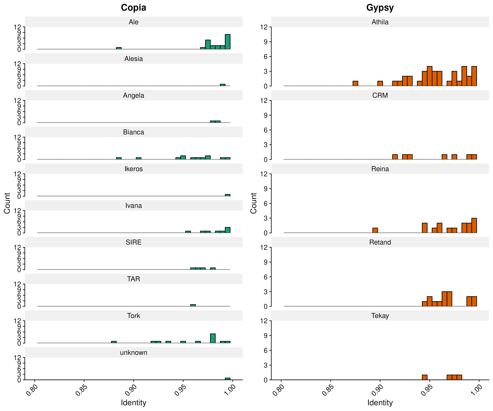

# UE-SBL.30004 Organisation and Annotation of Eukaryote Genomes

## Transposable Element Annotation and Classification  

### 1. TE Annotation using EDTA

### LTR-RTs
Counts per clade
| Clade    | Counts |
| -------- | ------- |
| Ale  | 28    |
| Alesia | 1     |
| Angela    | 2    |
| Athila | 43 |
| Bianca | 12 |
| CRM | 8 |
| Ikeros | 1 |
| Ivana | 11 |
| Reina | 20 |
| Retand | 17 |
| SIRE | 5 |
| TAR | 1 |
| Teaky | 4 |
| Trok | 15 |
| unknown | 1 |
| < NA > | 431 |

The results show that there are differences in the number of full length LTR-RTs between the clades with Athila having the most counts followed by Ale and Reina.

### Percent Identiy of Clades

- High percent identity: Ale, Angela, Tekay, Reina → recent insertions
- Low percent identity: Bianca, Tork, CRM